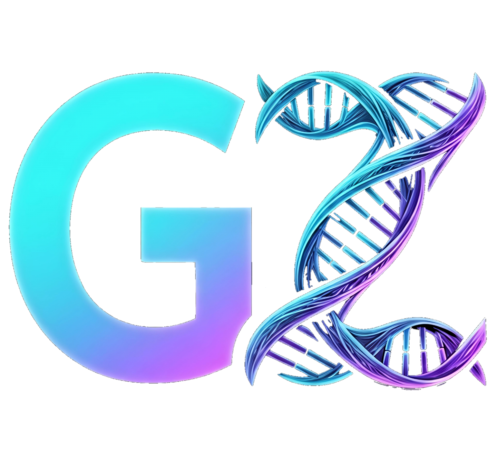

# Gene-Z: Biotechnology Team Academic Hub



Welcome to the **Gene-Z** project! This is the official academic hub and platform for the Biotechnology and Genetic Engineering Team. The project aims to provide an educational space, resource sharing platform, and community interaction hub for biotechnology students.

## 🌟 Overview

The Gene-Z platform is designed to be a comprehensive hub for academic resources, course materials, news, and community interaction. It features a modern, responsive user interface and a robust backend for content management and resource sharing.

## 🚀 Technologies Used

This project is built using a modern web development stack to ensure performance, scalability, and an excellent user experience:

- **HTML5 & Semantic UI**: For robust and accessible page structure.
- **Tailwind CSS**: A utility-first CSS framework for rapid UI development, providing a highly customizable and responsive design.
- **Vanilla JavaScript**: Pure JS for dynamic interactions, form validations, and asynchronous operations without the overhead of bulky frontend frameworks.
- **Firebase**: 
  - **Firestore**: Real-time NoSQL database for managing users, courses, and platform content.
  - **Firebase Authentication**: Secure user login and role-based access control (Admin vs. Student).
  - **Firebase Storage**: Cloud storage solution for handling images, documents, and media files.
- **Google Drive API**: Integrated for robust file management and sharing of heavy course materials and resources seamlessly.

## 📂 Project Structure

```
gene-z/
├── assets/
│   ├── css/          # Custom stylesheets (Vanilla CSS complementing Tailwind)
│   ├── img/          # Images, logos, and UI assets
│   └── js/           # Core logic, admin modules, and Firebase integration
├── components/       # Reusable UI fragments (header, footer, navbar)
├── pages/            # Main application views (Courses, News, Admin, etc.)
├── index.html        # Entry point / Landing Page
└── README.md         # Project documentation
```

## 🛠️ Features

- **Dynamic Content Management**: Admins can easily add, update, or remove courses, news, and resources.
- **Authentication System**: Secure login for administrators and users.
- **Responsive Design**: Flawless experience across desktops, tablets, and mobile devices.
- **Real-time Interactions**: Like, comment, and view tracking implemented efficiently.

## ⚙️ Setup & Local Development

1. Clone the repository:
   ```bash
   git clone https://github.com/your-username/gene-z.git
   ```
2. Navigate into the directory:
   ```bash
   cd gene-z
   ```
3. Open `index.html` in your browser or run a local server (e.g., Live Server extension in VS Code).

---
*Developed with ❤️ for the Gene-Z Biotechnology Team.*
